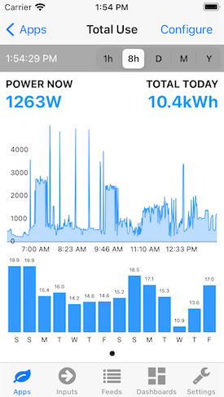

# Emoncms for iOS

 

## Screenshots

### Main screens

    

### Apps

  

### Today Widget

## Todo list

- [x] Basic app structure
- [x] Login
  - [x] Manual URL + API key
  - [x] Scan QR code
- [x] Data caching
- [ ] Apps
  - [x] My Electric app
  - [x] My Solar PV app
  - [x] My Solar PV + Divert app
- [x] Multi-account
- [ ] Extensions
  - [ ] Universal app (for iPad)
  - [ ] watchOS app
  - [x] Today extension
  - [ ] tvOS app

