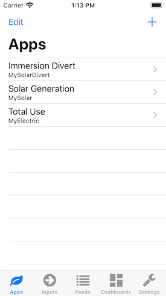

# Emoncms for iOS

 

   

## Todo list

- [x] Basic app structure
- [x] Login
  - [x] Manual URL + API key
  - [x] Scan QR code
- [x] Data caching
- [ ] Apps
  - [x] My Electric app
  - [ ] My Solar PV app
- [ ] Multi-account
- [ ] watchOS app
- [ ] Today extension
- [ ] tvOS app

